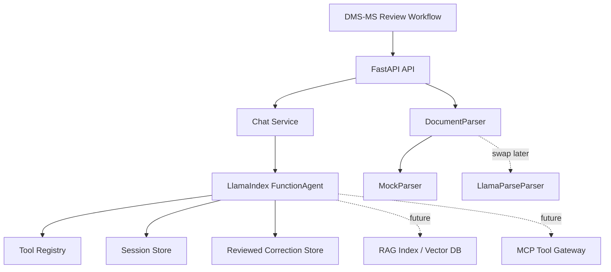

# Forbaxy PD Extraction Agent

Production-ready local FastAPI service for a PD-only prescription extraction and review-learning
agent using Python 3.12, LlamaIndex, and OpenAI-compatible LLMs.

This service must receive only cropped Prescription Details (PD). It never needs Patient
Information (PI), and the prompt plus sanitation layer instruct the agent to ignore PI-like text if
it accidentally appears.

## Architecture



## Local Setup

1. Install `uv`.
2. Copy `.env.example` to `.env`.
3. Set `OPENAI_API_KEY`; keep `MODEL_NAME=meta-llama/llama-4-scout-17b-16e-instruct`
   for Groq.
4. Run:

```powershell
uv sync --all-groups
uv run uvicorn app.main:app --reload --host 0.0.0.0 --port 8000
```

Open API docs at `http://localhost:8000/docs`.

## Docker

```powershell
docker compose up --build
```

## API Examples

Health:

```bash
curl http://localhost:8000/health
```

Chat:

```bash
curl -X POST http://localhost:8000/chat \
  -H "Content-Type: application/json" \
  -d '{"session_id":"123","message":"Analyze this PD crop text: Rx Tab Paracetamol 500mg BD 3 days"}'
```

Upload PD document placeholder:

```bash
curl -X POST http://localhost:8000/documents/upload \
  -F "file=@pd_crop.txt"
```

Production PD extraction:

```bash
curl -X POST http://localhost:8000/pd/extract \
  -H "Content-Type: application/json" \
  -d '{
    "content": "Chief complaint fever. Diagnosis viral fever. Rx Tab Paracetamol 500mg BD.",
    "content_type": "text",
    "learning_context": {
      "guidance": "Prefer visible dosage evidence only.",
      "patterns": ["BD means twice daily"],
      "common_corrections": ["Dosage is often omitted by OCR"]
    },
    "learning_metadata": {
      "retrieval_matches": 3,
      "average_similarity": 0.89,
      "context_size": 640
    },
    "extraction_id": "pd_123",
    "prescription_id": "rx_456",
    "provider": "groq",
    "model": "meta-llama/llama-4-scout-17b-16e-instruct"
  }'
```

`content_type=image` and `content_type=document` accept base64/data URL PD crop payloads. When
`PARSER_MODE=llamaparse`, the service sends that crop to LlamaParse first, then passes the parsed PD
text into the extraction agent. `content_type=text` still accepts already-parsed PD text directly.

Session:

```bash
curl http://localhost:8000/sessions/123
curl -X DELETE http://localhost:8000/sessions/123
```

## JSON Contract

The agent system prompt requires strict JSON:

```json
{
  "pd_extraction": {
    "chief_complaints": [],
    "history": "",
    "allergies": "",
    "examination": "",
    "diagnosis": "",
    "vitals": {
      "bp": "",
      "pulse": "",
      "spo2": "",
      "temperature": "",
      "weight": "",
      "height": "",
      "pain_score": "",
      "rbs": ""
    },
    "investigations": [],
    "medicines": [],
    "preventive_advice": "",
    "follow_up": {"date": "", "instruction": ""},
    "admission": {"advised": false, "reason": "", "ipd_probability": 0, "risk_category": "low"},
    "consultant": {"name": "", "department": "", "specialty": ""},
    "medication_assessment": {
      "status": "unclear",
      "confidence": 0,
      "rationale": "",
      "flags": [],
      "missing_treatment_concerns": [],
      "excess_treatment_concerns": [],
      "review_recommended": true
    },
    "extraction_confidence": 0,
    "unclear_fields": [],
    "notes": ""
  }
}
```

The `/pd/extract` response is aligned with Yii production integration and always includes these
safe-default fields: `admission_advised`, `follow_up_date`, `consultant`, `patient.follow_up`,
`issues`, `vitals.rbs`, and `learning_metadata.learning_used`. `learning_used` is true only when
non-empty learning guidance is actually injected into the prompt.

## Why This Supports LlamaParse Later

- `DocumentParser` is the only parsing dependency used by API code.
- `MockParser` works now for local development.
- `LlamaParseParser` is a drop-in future implementation.
- The agent receives parsed PD content, not parser SDK objects.
- Prescription workflow folders already exist for parsers, services, tools, agents, and schemas.

## Review Learning

`ReviewLearningStore` is an interface for corrected DMS-MS examples. The in-memory implementation
is local-only. Replace it with PostgreSQL, Redis, or a vector store to retrieve reviewed examples
without changing agent or API business logic.

Learning priorities are encoded in the system prompt: hospital layout, handwriting patterns,
consultant styles, abbreviations, department patterns, and repeated DMS-MS corrections. PI is never
part of the learning contract.

## Quality Commands

```powershell
uv run ruff check .
uv run pytest
```

## GitHub Deployment Readiness

The repository includes `.github/workflows/ci.yml` to install dependencies, lint, test, and build a
Docker image on pull requests and pushes to `main`.

## Architectural Decisions

- FastAPI routes are thin and delegate to services.
- `PrescriptionAgent` wraps LlamaIndex `FunctionAgent`, so multi-agent handoff and MCP tools can be
  added behind the same port.
- Tool registry makes tools plug-and-play and keeps function descriptions close to code.
- Session memory is abstracted through `SessionStore`; Redis/Postgres can replace in-memory storage.
- Review learning is abstracted through `ReviewLearningStore`; later retrieval can use vector search.
- Parser dependency is inverted through `DocumentParser`, keeping LlamaParse optional and swappable.
- Structured JSON logging uses request IDs for production tracing.
- Central exception handlers keep error responses consistent.
