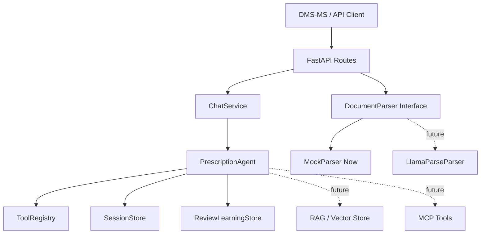

# Architecture

The production boundary is the `DocumentParser`, `SessionStore`, `ReviewLearningStore`, and
`ToolRegistry` interface set. Business logic depends on these abstractions, not vendor SDKs.

